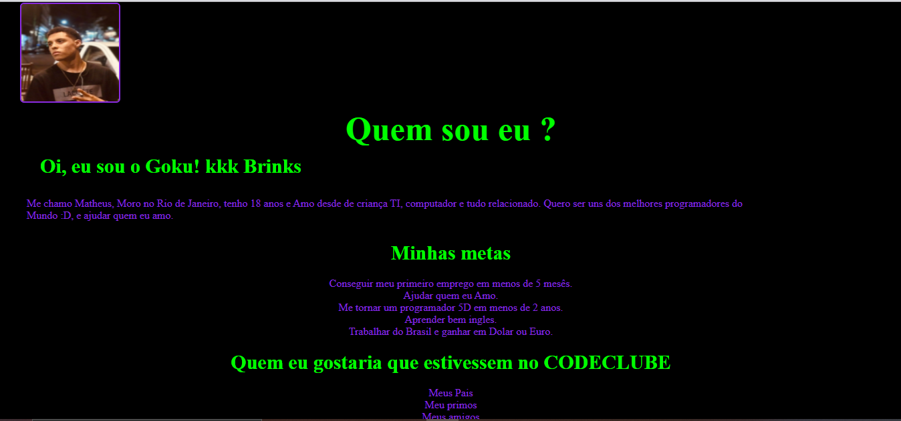

# HTML-Challenge

> Challenge HTML- CODECLUBE

### Ajustes e melhorias

O projeto ainda está em desenvolvimento e as próximas atualizações serão voltadas nas seguintes tarefas:

- [x] Html 
- [x] Css 
- [ ] JavaScript
 

## 🤝 Colaboradores

Agradecemos às seguintes pessoas que contribuíram para este projeto:

<table>
  <tr>
    <td align="center">
      <a href="#">
         
        
          <b>Matheus Andrade</b>
        
      </a>
  </tr>
</table>

 
